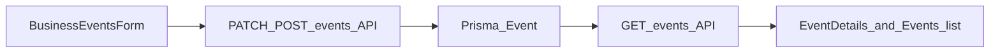

# Event time and entrance fee (BusinessEvents)

## Current behavior

- [BusinessEvents.jsx](sec-night-life/src/pages/BusinessEvents.jsx) only sends `date` from `type="date"` (calendar day). The backend stores a `DateTime` but [events.js](sec-night-life/backend/src/routes/events.js) serializes it as `date: e.date.toISOString().slice(0, 10)` only—no time.
- The **Event** model in [schema.prisma](sec-night-life/backend/prisma/schema.prisma) has `date DateTime` but **no** `start_time` or entrance-fee columns.
- Multiple pages already read **`event.start_time`** for display (e.g. [EventDetails.jsx](sec-night-life/src/pages/EventDetails.jsx) line ~244 shows `event.start_time || 'TBA'`; [Events.jsx](sec-night-life/src/pages/Events.jsx) ~437). Those values are effectively always missing for API-backed events today.

## Recommended data model

Add to `Event`:

- **`start_time`** — optional `String?` (store 24h `HH:mm`, same pattern as [Job](sec-night-life/backend/prisma/schema.prisma) `startTime`).
- **`has_entrance_fee`** — `Boolean` default `false` (`@map("has_entrance_fee")`).
- **`entrance_fee_amount`** — optional `Float?` (`@map("entrance_fee_amount")`), meaningful when `has_entrance_fee` is true.

Keep **`date`** as the calendar day (continue normalizing to a `DateTime` for that day as today’s code does). **Time** lives in `start_time`, avoiding timezone ambiguity from mixing “date-only” and “full ISO” in one column and matching existing UI props.

Run a Prisma migration (or `db push` if that is how this project deploys—there are no checked-in SQL migrations under `backend/prisma` today).

## Backend ([events.js](sec-night-life/backend/src/routes/events.js))

1. Extend `eventSchema` / partial schema with:

   - `start_time`: optional nullable string (validate `HH:mm` with a regex or short refine).
   - `has_entrance_fee`: optional boolean (default false on create).
   - `entrance_fee_amount`: optional nullable number; if present when `has_entrance_fee` is true, require `>= 0` (and optionally require amount when fee is on—product rule).

2. **All JSON responses** that map events (`GET /`, `GET /filter`, `GET /:id`, create/patch responses as applicable) should include:

   - `start_time`, `has_entrance_fee`, `entrance_fee_amount`
   - Keep existing field names (`date` as `YYYY-MM-DD` string is fine and consistent with current clients).

3. **Create / PATCH**: map new fields to Prisma (`startTime`, `hasEntranceFee`, `entranceFeeAmount`).

## Frontend — Business Events ([BusinessEvents.jsx](sec-night-life/src/pages/BusinessEvents.jsx))

1. Extend `EMPTY_EVENT` and `openEdit` with `start_time`, `has_entrance_fee`, `entrance_fee_amount`.
2. Add form controls:

   - **`type="time"`** next to the date field (or second row): label e.g. “Start time” (optional or required—recommend **optional** so legacy “TBA” remains possible, unless you prefer required when publishing).

3. **`handleSave`**: include `start_time` in payload when set; include `has_entrance_fee` and `entrance_fee_amount` (when fee is on, validate amount before submit).
4. Optional UX: checkbox or switch “Entrance fee” + number input (ZAR) shown only when enabled.
5. **List rows** (~230): show time next to date when `start_time` is present (e.g. `evt.date · evt.start_time · city`).

## Display updates (minimal but consistent)

- [EventDetails.jsx](sec-night-life/src/pages/EventDetails.jsx): Time tile already uses `start_time`; add a short line for **entrance** (e.g. “Free entry” / “R{amount} entrance”) when `has_entrance_fee` is true, without duplicating the existing **Tickets** block driven by `ticket_tiers`.
- [Events.jsx](sec-night-life/src/pages/Events.jsx): The price row (~456) currently infers “Free Entry” only from `ticket_tiers`. Adjust copy so **door/entrance fee** is reflected when `has_entrance_fee` (e.g. show entrance price even if there are no ticket tiers), without breaking “From R…” for tiered tickets.

Touch other files only if they list venue events and should show time/fee: [FeaturedEventCard.jsx](sec-night-life/src/components/home/FeaturedEventCard.jsx), [VenueProfile.jsx](sec-night-life/src/pages/VenueProfile.jsx) (optional one-line entrance note).

## Data flow (high level)

## Testing (manual)

- Create event with date + time; confirm list, Event Details, and Events browse show the time.
- Toggle entrance fee on/off and set price; confirm displays and that API round-trips on edit.
- Regression: existing events without `start_time` still show **TBA** / omit clock where applicable.